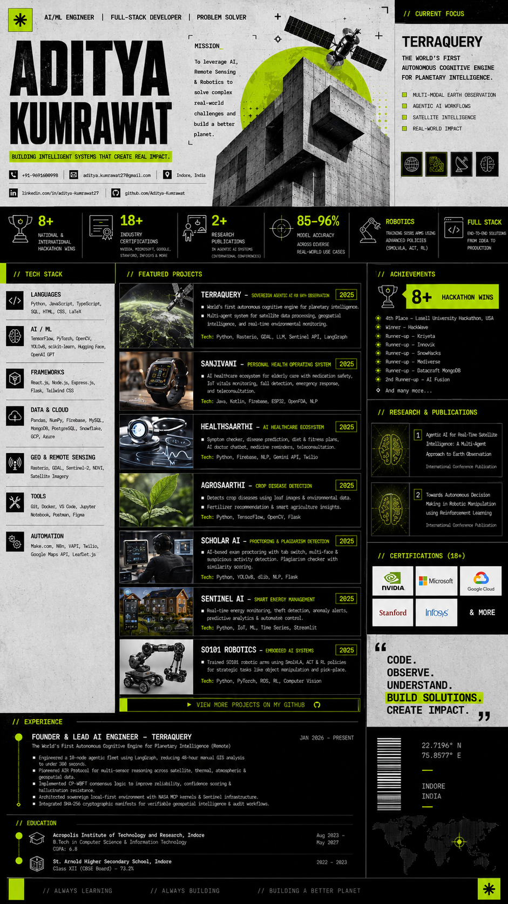

<div align="center">
  
</div>
<div align="center">


</div>

<br/>

<div align="center">

[](https://github.com/Aditya-Kumrawat)

</div>

<br/>

```
██████████████████████████████████████████████████████████████████████████████
█                                                                            █
█   ADITYA KUMRAWAT  //  B.Tech CSIT @ Acropolis, Indore  //  Batch 2027    █
█                                                                            █
█   Founder @ TerraQuery  ·  Robotics Lab In-Charge  ·  AI Researcher       █
█   8+ Hackathon Wins  ·  18+ Certifications  ·  1,294 Contributions/yr     █
█                                                                            █
██████████████████████████████████████████████████████████████████████████████
```

<div align="center">


[](https://linkedin.com/in/aditya-kumrawat27)
[](https://github.com/Aditya-Kumrawat)
[](mailto:aditya.kumrawat27@gmail.com)
[](https://github.com/Aditya-Kumrawat)

</div>

---


<br/>

> ### 🛰️ TERRAQUERY — SOVEREIGN AGENTIC AI FOR EARTH OBSERVATION

```
┌─────────────────────────────────────────────────────────────────────────┐
│  STATUS   ██████████████████████████████░░░░  ACTIVE DEVELOPMENT        │
│  STACK    LangGraph · Rasterio · GDAL · Sentinel API · LLM Agents       │
│  SCOPE    Defense · Carbon Auditing · Disaster Intelligence             │
└─────────────────────────────────────────────────────────────────────────┘
```

**What it does:** A hypothesis-driven Earth observation engine. Ask it anything about the planet — it deploys a fleet of AI agents to pull live satellite data, process it, reason over it, and return verifiable intelligence. No human in the loop.

| Capability | Detail |
|---|---|
| ⚡ **Speed** | 48-hour manual GIS workflow → **300 seconds** |
| 🤖 **Architecture** | 10-node agentic fleet via LangGraph |
| 🛡️ **Reliability** | CP-WBFT consensus — hallucination-resistant |
| 🔐 **Integrity** | SHA-256 cryptographic evidence manifests |
| 🌍 **Data Sources** | ESA Sentinel-1/2/3/5P · NASA Earthdata · Google Earth Engine |
| 📡 **Use Cases** | Wildfire · Floods · Glaciers · Air quality · Maritime surveillance |

`Python` `LangGraph` `Rasterio` `GDAL` `Sentinel API` `NASA MCP` `OpenAI`

---


<br/>

<table>
<tr>
<td width="50%" valign="top">

**■ HEALTHSAARTHI**
`Healthcare AI Ecosystem`

End-to-end healthcare platform with AI diagnostics, AR/VR exercise guidance, and IoT wearable integration.

- 87% disease detection accuracy — CNN on 10K+ medical images
- 92% skeletal tracking accuracy via YOLOv8 pose estimation
- ESP32 IoT continuous vitals + emergency SOS with live GPS

`TensorFlow` `React` `YOLOv8` `OpenCV` `Node.js` `Firebase`

</td>
<td width="50%" valign="top">

**■ AGROSAARTHI**
`Precision Agriculture`

CV-powered crop disease detection across 38+ diseases with LLM-driven treatment recommendations.

- 94% accuracy — custom CNN trained on 50K+ leaf images
- Treatment engine powered by Gemma LLM
- Real-time weather API + soil condition context

`Flask` `TypeScript` `React` `TensorFlow` `Gemma LLM`

</td>
</tr>
<tr>
<td width="50%" valign="top">

**■ SCHOLAR AI**
`EdTech + Academic Integrity`

AI proctoring + plagiarism detection platform for exam integrity and automated grading workflows.

- 96% plagiarism detection via Gemini + semantic similarity
- 15+ cheating behaviours detected with 89% precision
- Grading automation via Make.com — significant time reduction

`OpenCV` `dlib` `NLP` `Gemini API` `React` `Firebase`

</td>
<td width="50%" valign="top">

**■ SANJIVANI**
`Personal Health OS for Elderly`

Full-stack IoT healthcare ecosystem for elderly care — medication intelligence, IoT vitals, emergency response.

- ESP32-based MedIOT: heart rate, SpO2, temp, fall detection
- OCR pill scanner + OpenFDA drug interaction detection
- Emergency QR — allergy/meds accessible without login

`Kotlin` `ESP32` `Firebase` `OpenFDA` `OCR` `RAG`

</td>
</tr>
<tr>
<td width="50%" valign="top">

**■ SENTINEL AI**
`Smart Energy Management`

AI-powered home energy optimization with predictive load balancing and emergency power rerouting.

- 35% simulated energy reduction via predictive analytics
- Critical system rerouting (medical, security) in under 2 seconds
- Analytics dashboard with cost predictions + usage graphs

`TensorFlow` `Langchain` `Flask` `React` `Gemini`

</td>
<td width="50%" valign="top">

**■ SO101 ROBOTICS**
`Embodied AI + Reinforcement Learning`

Trained SO101 robotic arms using Vision-Language-Action models and RL algorithms for strategic gameplay.

- Policy architectures: SmolVLA + ACT (Action Chunking Transformer)
- Custom RL — multi-step planning for Tic-Tac-Toe
- Policy convergence across multiple manipulation tasks

`Python` `SmolVLA` `ACT` `Reinforcement Learning`

</td>
</tr>
</table>

---


<br/>

<div align="center">

**LANGUAGES**

[](https://skillicons.dev)

**FRONTEND · BACKEND · DATABASES**

[](https://skillicons.dev)

**AI / ML**

[](https://skillicons.dev)

`YOLOv8` `Hugging Face` `LangGraph` `Mediapipe` `dlib` `scikit-learn` `SmolVLA` `ACT Transformer` `OpenAI GPT`

**GEOSPATIAL / EARTH OBSERVATION**

`Rasterio` `GDAL` `ESA Sentinel-1/2/3/5P` `NASA Earthdata` `Google Earth Engine` `NDVI` `Leaflet.js`

**CLOUD · DEVOPS**

[](https://skillicons.dev)

`Snowflake` `Render` `Make.com` `N8n` `VAPI` `Twilio`

</div>

---


<br/>

<div align="center">


<br/>

<table>
<tr>
<td>

</td>
<td>

</td>
</tr>
</table>

> ⚡ **1,294 contributions** in the last year — go to **Profile → Contribution Settings → enable Private Contributions** to show your full activity

</div>

---


<br/>

<table>
<tr>
<td width="55%" valign="top">

### ⚔️ HACKATHON RECORD

```
BATTLE                      RESULT          FORMAT
─────────────────────────────────────────────────────
HackWave 2.0                WINNER    ──    36hr National
AI Fusion Hackathon         WINNER    ──    National
Kriyeta 5.0                 RUNNER-UP ──    36hr National
Innovik 5.0                 RUNNER-UP ──    24hr National
SnowHacks                   RUNNER-UP ──    National
Mediverse                   RUNNER-UP ──    12hr
Datacraft MongoDB           RUNNER-UP ──    National
Tech-O-Tsav                 RUNNER-UP ──    Web + Innovation
LaserHack @ Lasell USA 🇺🇸   TOP 4     ──    International
─────────────────────────────────────────────────────
8+ WINS  ·  15+ BATTLES  ·  NEVER QUIT
```

</td>
<td width="45%" valign="top">

### 📚 RESEARCH + RECOGNITION

```
AWARD                    VENUE
──────────────────────────────────────────
Published Paper          SICA Intl. Conf.
                         2024
Best Innovation Stall    IIC Regional Meet
                         Govt. of India
──────────────────────────────────────────
```

*"Designing Agentic AI Systems Using Deep Neural Networks in Dynamic Environments"*
→ **40% improvement** over rule-based systems

### 🏛️ LEADERSHIP
```
Student In-Charge  ·  Robotics Lab
                       Solo Tech USA × AITR
ACM Chapter        ·  Designer & Content Lead
                       200+ members · 1K+ reach
```

</td>
</tr>
</table>

---


<br/>

<div align="center">

| Issuer | Certification |
|--------|--------------|
| 🛸 **ISRO** | AI/ML for Satellite Crop Area Mapping |
| ⚡ **NVIDIA** | Fundamentals of Deep Learning for Computer Vision |
| 🎓 **Stanford** | Supervised Machine Learning: Regression & Classification |
| ☁️ **Google Cloud** | Production ML Systems · MLOps Fundamentals |
| 🪟 **Microsoft** | Foundations of Artificial Intelligence & Machine Learning |
| 🎓 **Harvard** | CS50: Intro to Computer Science · Aspire Leaders Program |
| 🔷 **Infosys** | Deep Learning · NLP · Transformers · Prompt Engineering (×4) |

**18+ CERTIFICATIONS TOTAL**


</div>

---


<br/>

<div align="center">

</div>

---


<br/>

<div align="center">

[](https://linkedin.com/in/aditya-kumrawat27)
&nbsp;
[](mailto:aditya.kumrawat27@gmail.com)
&nbsp;
[](https://github.com/Aditya-Kumrawat)

<br/>

```
"I didn't wait to finish my degree to start building the future."
                                         — ADITYA KUMRAWAT
                                           FOUNDER @ TERRAQUERY
```

</div>


