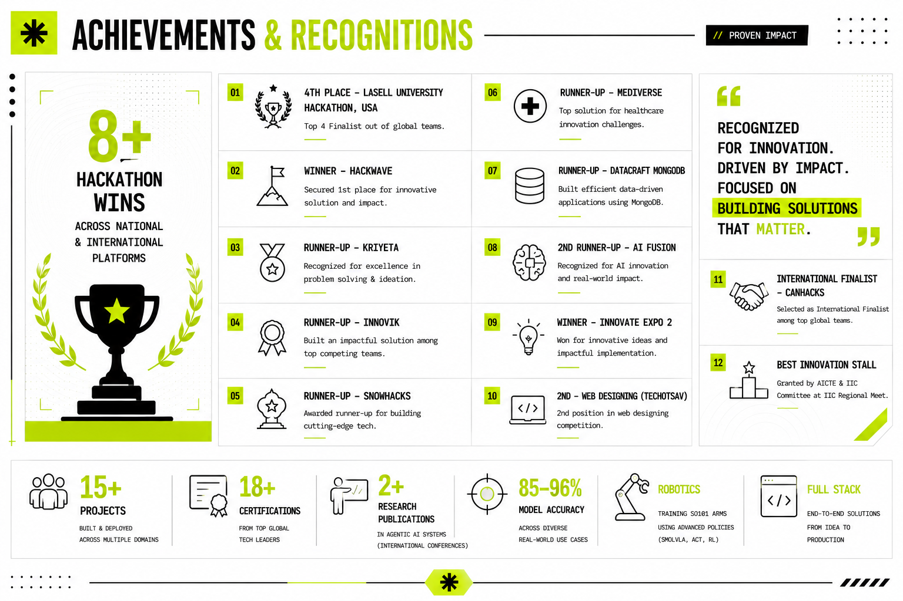
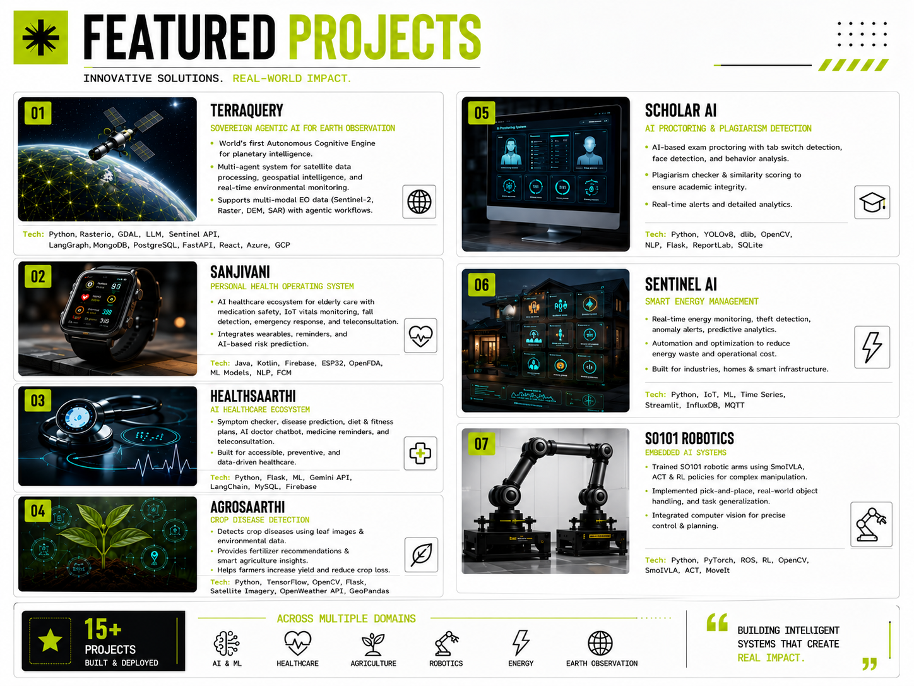
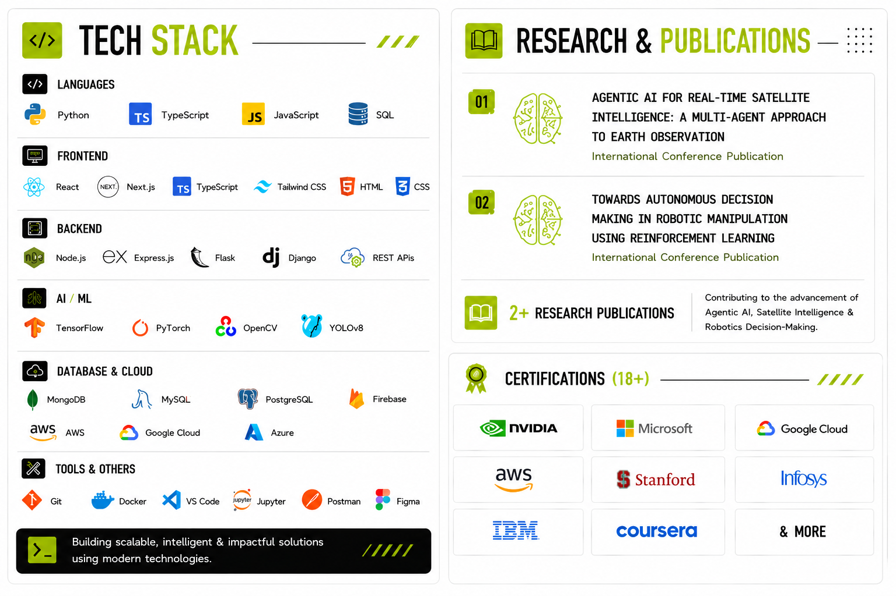
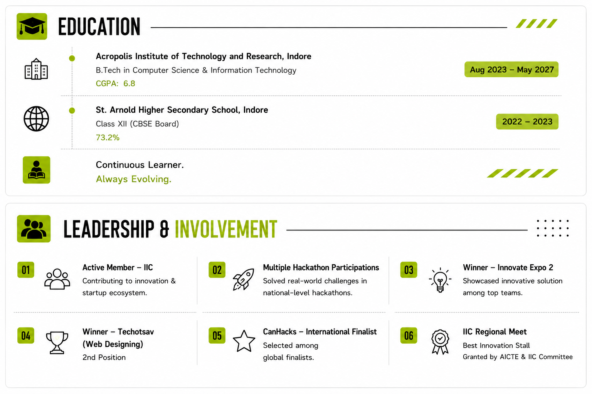

<div align="center">
  
</div>
<div align="center">
  
</div>
<div align="center">
  
</div>
<div align="center">
  
</div>
<div align="center">
  
</div>
[](https://github.com/Aditya-Kumrawat)

</div>

<br/>


<br/>

<div align="center">


<br/>

<table>
<tr>
<td>

</td>
<td>

</td>
</tr>
</table>

> ⚡ **1,294 contributions** in the last year — go to **Profile → Contribution Settings → enable Private Contributions** to show your full activity


<br/>

<div align="center">


<br/>

<div align="center">

</div>

---


<br/>

<div align="center">

[](https://linkedin.com/in/aditya-kumrawat27)
&nbsp;
[](mailto:aditya.kumrawat27@gmail.com)
&nbsp;
[](https://github.com/Aditya-Kumrawat)

<br/>

```
"I didn't wait to finish my degree to start building the future."
                                         — ADITYA KUMRAWAT
                                           FOUNDER @ TERRAQUERY
```

</div>


